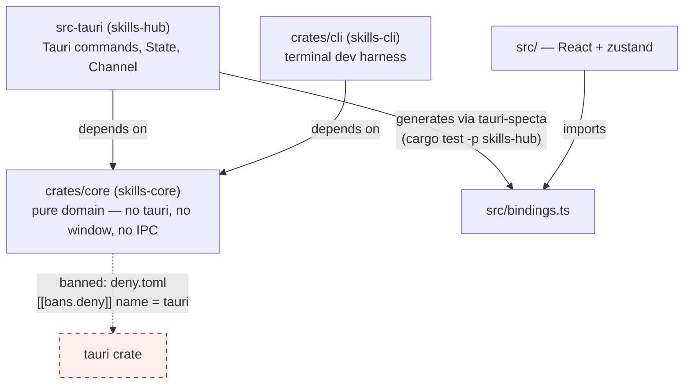
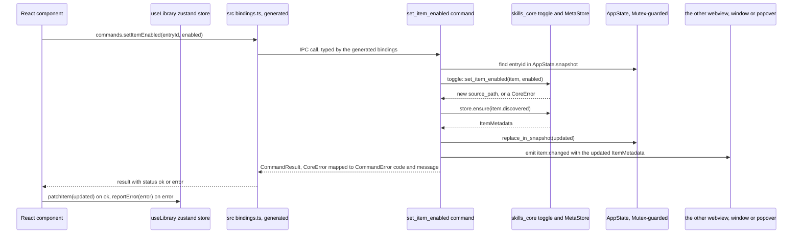

# Architecture

This document is for an engineer, human or otherwise, who has never opened this
repository and needs to make a correct change to it without first reading
every file. It explains the layers and why they exist, the shapes the domain
is built from, how a skill sitting in a folder on disk becomes a card in the
window, where state lives and who owns writing it, which files are generated
rather than hand-written, and which invariants a change must not break even
though nothing but a test — or careful reading — would catch the break.

It does not repeat what other documents already own. `README.md` is the pitch
and the install instructions. `CLAUDE.md` holds the exact commands and a list
of mistakes already made once. `CONTRIBUTING.md` owns the git workflow,
versioning and release process. `plan.md` owns what is still undecided or
queued. This document is the only one that tries to explain the system as a
whole, in enough depth that its claims are checkable against the code that
backs them — every non-obvious statement below cites the file, and often the
symbol, it was verified against.

## The three crates, and what actually enforces the boundary between them

The workspace (`Cargo.toml`) has three members: `crates/core` (package
`skills-core`), `crates/cli` (`skills-cli`), and `src-tauri` (`skills-hub`,
the library half of the Tauri app). A fourth "layer", `src/`, is the React
frontend and is not a Rust crate at all — it talks to `src-tauri` only through
generated TypeScript bindings.

`crates/core/src/lib.rs` states the rule in its module doc: the crate "knows
nothing about Tauri, about a window, or about a user interface. Everything it
touches is either a path it was handed or a value it was given." That is not
a convention held together by review. `deny.toml` bans `tauri` as a dependency
of anything in the workspace graph (`[[bans.deny]] name = "tauri"`), and
`crates/core/Cargo.toml` has no such dependency to begin with — a `cargo deny
check` run (wired into CI, see `CONTRIBUTING.md`) fails the build the moment
that stops being true, rather than merely failing a review.

`crates/cli` is the second half of the proof, not a convenience. It links
`skills-core` and nothing workspace-local beyond it (`crates/cli/Cargo.toml`),
and its own doc comment says why it exists: "It also keeps the layering
honest: this binary links `skills-core` and nothing else." If a change to the
domain accidentally required something only `src-tauri` provides — an
`AppHandle`, a window — `skills-cli` stops compiling. Use it to exercise the
scanner and the rescan pipeline against real folders without building the
whole app: `cargo run -p skills-cli -- scan`, `-- rescan <dir>`, `-- usage
<tool>`, `-- mcp`, `-- discover <url>`, `-- toggle <name> on|off --dry-run`
(`crates/cli/src/main.rs`).

`src-tauri/src/lib.rs` is the adapter: "Nothing in here makes a domain
decision. It resolves the paths the platform owns, holds shared state, maps
core errors onto a serialisable shape, and adapts the core's progress callback
onto a Tauri channel." Every `#[tauri::command]` in `src-tauri/src/commands/`
follows that shape — parse input, call into `skills_core::*`, map
`CoreError` to `CommandError` (`src-tauri/src/error.rs`), touch `AppState`
just enough to keep the cached snapshot in step.

One more decision holds this apart from a typical desktop app: `$HOME` is a
parameter threaded through the domain (`paths::resolve_tool_dir`,
`scan::scan_tool`, …) rather than read from the environment inside
`crates/core`. `crates/core/src/paths.rs`'s module doc says this plainly: it
"is what makes the scanner testable against a temporary directory instead of
only against the machine it runs on." Only `src-tauri/src/lib.rs::load_state`
and `crates/cli/src/main.rs::home()` ever call `dirs::home_dir()`.

## The domain model

Everything downstream is built from a small set of shapes in
`crates/core/src/model.rs`.

- **`ItemType`** — `Skill | Agent | Command | Rule`. `ItemType::ALL` fixes the
  order the UI presents them in.
- **`ToolConfig`** — one AI coding tool and where it keeps things: `paths`
  (global scope), `project_paths` (per-project overrides, falling back to
  stripping `~/` off the global path — see `paths::to_project_relative`),
  `unconfirmed_paths` (documented but never scanned, offered as a suggestion),
  plus fields for plugin bundle discovery and MCP config location. The
  registry itself — the sixteen-plus shipped tools — is source code, not data:
  `crates/core/src/tools.rs::default_tools()`, built with a small `Tool`
  builder. Its own doc comment explains why: "several are deliberate
  exceptions that look like mistakes without the reason written beside them. A
  JSON file cannot hold those reasons; the compiler also cannot check it."
  Tool **names, icons and brand marks are not here** — that presentation
  lives in `src/toolMeta.ts` (see "Generated vs hand-written" for the
  cross-check that keeps the two in step).
- **`DiscoveredItem`** — what one scan pass found on disk: `entry_id`,
  `source_path` (the `SKILL.md` for a folder skill, the file itself
  otherwise), `real_path` (symlinks resolved), which `tool`/`project_id`/
  `plugin_id` it belongs to, `name`/`description` (read from frontmatter),
  `enabled` (derived from which folder it physically sits in), `modified`.
- **`ItemMetadata`** — a `DiscoveredItem` plus everything the user said about
  it: `tags`, `favorite`, `collections`, and `InstallSource` (provenance: repo,
  ref, subpath, commit — set only for items installed through the app's own
  Discover flow). This is the shape that crosses the IPC boundary as "the
  item"; `DiscoveredItem` is largely an implementation detail of scanning.
- **`ProjectWorkspace`**, **`PluginSource`**, **`CollectionDef`**,
  **`BrokenSymlink`**, **`ScanWarning`** round out the model — a folder scanned
  in addition to the home directory, a plugin bundle and its items, a named
  grouping the user defined, a dangling symlink, and something the scan could
  not do (permission denied, unreadable, malformed) respectively.

### Identity: `entry_id`

`crates/core/src/ids.rs::entry_id` hashes `(tool_id, item_type, project_id,
plugin_id, name, stable_entry_path(source_path))` with BLAKE3, keeping a
readable 32-character slug of the name as a prefix and 16 hex digits of the
hash for uniqueness. Two things make this the identity scheme rather than an
implementation detail:

1. **It must survive being disabled.** Disabling an item moves it into a
   `.skillmanager-disabled` sibling folder, which changes its path.
   `ids::stable_entry_path` strips every `.skillmanager-disabled` path
   component before hashing, so the id — and therefore the metadata note tied
   to it — does not change when the item does.
2. **It must not truncate the path.** The Obsidian plugin this application is
   derived from slugged the whole identity tuple and cut the result to 80
   characters (see the module doc and the regression test
   `long_paths_sharing_an_eighty_character_prefix_do_not_collide`), which for
   a deeply nested path discarded the path discriminator entirely — two
   different items could share one metadata note and silently overwrite each
   other's tags. Hashing the full stable path has no such ceiling.

## From a folder on disk to a card in the interface

```mermaid
flowchart TD
    A["tools::default_tools() + AppSettings.tool_overrides"] --> B["settings::effective_tools()"]
    B --> C["rescan::perform_rescan (crates/core/src/rescan.rs)"]
    C --> D["walk(): scan::scan_tool / scan_project<br/>per tool × per project, in parallel (rayon)<br/>via paths::resolve_tool_dir + scan::Walk —<br/>pairs enabled folder with its .skillmanager-disabled<br/>sibling at every depth, up to MAX_SCAN_DEPTH = 4"]
    D --> E["scan::scan_all_plugins()<br/>bundle items merged into the item list"]
    E --> F["scan::scan_broken_symlinks()"]
    F --> G["record(): store.ensure() per item<br/>parallel — one note write each,<br/>only when the rendered note actually changed"]
    G --> H["prune(): store::prune()<br/>orphan / trash, refused unless the scan<br/>was full, warning-free and found something"]
    H --> I["LibrarySnapshot { items, plugins,<br/>broken_symlinks, warnings, version }"]
    I --> J["src-tauri commands::library::rescan<br/>streams Progress over a Tauri Channel as it runs"]
    J --> K["AppState.snapshot — cache, not the source of truth"]
    K -->|"tauri-specta IPC, typed by src/bindings.ts"| L["useLibrary (src/stores/library.ts)<br/>replaces the whole snapshot object"]
    L --> M["lib/library.ts::deriveLibrary(items, scope, filters)<br/>one pass: visible list + sidebar counts together"]
    M --> N["components/grid/ItemGrid → Card"]
```

Walking through it: `scan::Walk` (`crates/core/src/scan/mod.rs`) recognises
exactly two shapes on disk — a folder containing `SKILL.md` (the folder is the
item) and a flat `.md` file (the file is the item) — and nothing else; a
folder that is neither is a category and is descended into, which is what
makes `skills/engineering/tdd/SKILL.md` work. `Walk::category` calls
`Walk::entries` twice per directory, once for the folder itself and once for
its `.skillmanager-disabled` sibling, and does this **recursively at every
depth**, not only at the configured root — the module doc is explicit that
"the enabled and disabled halves have to be paired at *every* level of the
walk". Frontmatter is read with a deliberately lenient parser
(`crates/core/src/frontmatter.rs`) that only looks at the first 4 KiB of a
file and never fails — it is fed files hand-written by a dozen different
tools and a truncated or malformed block is expected, not exceptional.

`rescan::perform_rescan` (`crates/core/src/rescan.rs`) is the orchestrator:
it walks every tool and every project in parallel (`rayon`, one task per
root), folds in the plugin scan and the broken-symlink scan, records every
found item into the `MetaStore` (also in parallel — each item writes its own
note file), and only then prunes. The order matters, and the doc comment says
so: "Items are recorded before anything is pruned, and pruning is handed the
evidence it needs to decide whether it is entitled to act at all." See
"Invariants" below for what that evidence is.

On the Rust/TypeScript boundary, `src-tauri/src/lib.rs::specta_builder()` is
the single list of every command (`collect_commands!`); `main` mounts it and
a test (`export_typescript_bindings`) exports it to `src/bindings.ts`. Nothing
downstream of that function needs to know Tauri exists — `src-tauri/src/commands/*`
already reduced every operation to typed Rust functions.

On the frontend, `useLibrary` (`src/stores/library.ts`) holds exactly one
`LibrarySnapshot | null` and replaces it wholesale on a scan — `patchItem`
and `removeItem` exist so a single-item command (toggle, tag, delete) can
update one row without a full rescan. `lib/library.ts::deriveLibrary` is the
one place that turns a snapshot plus the current `Scope` (exclusive — see
`src/stores/filters.ts`, "Skills" replaces "Cursor") and `Filters` (compound —
a tag survives navigating to a different tool) into what is rendered, in a
single pass, specifically so the sidebar counts cannot disagree with the grid
they describe.

### Two other flows worth knowing by name

- **Enable/disable** (`crates/core/src/toggle.rs`) moves the item's unit — a
  skill's folder or a lone file, resolved by `fsunit::linkable_unit` — into or
  out of `.skillmanager-disabled`. It is the one module in the domain crate
  that destroys anything, and it is deliberately small: its own doc comment
  says why — "kept deliberately small so that all of it can be held in mind at
  once."
- **Install / update / restore** (`crates/core/src/install.rs`,
  `crates/core/src/diff.rs`, `crates/core/src/git.rs`) shallow-clones a
  repository with the `git` binary (not a git library — see `git.rs`'s module
  doc for the three reasons), strips `.git` before anything touches disk, and
  for an update or restore builds a `Review` (a diff plus a list of companion
  file changes) that the caller must apply explicitly. The clone backing a
  prepared review is held in `AppState.reviews`
  (`src-tauri/src/state.rs::PendingReview`) rather than re-cloned when
  applied — re-cloning could apply something other than what the diff showed.
  Unapplied reviews are swept after fifteen minutes
  (`state::REVIEW_LIFETIME`).

### The command round trip

A full rescan is not how most changes reach the window. Toggling, tagging,
favouriting, deleting — anything that acts on one item — goes through a single
Tauri command and patches the cached snapshot in place, rather than
re-scanning. `set_item_enabled` is representative of the shape every such
command follows (`src-tauri/src/commands/items.rs`,
`src/stores/library.ts::patchItem`):

Two things this makes explicit that the prose elsewhere does not: every
command result is a discriminated `{ status: "ok", data } | { status: "error",
error }` (checked the same way in every store — `library.ts`, `settings.ts`,
`discover.ts` all branch on `result.status === "error"` before touching
`result.data`), and the error a component sees is always the stable
`CommandError.code` produced from `CoreError::code()`
(`crates/core/src/error.rs`, `src-tauri/src/error.rs`) — never a raw Rust
error string to pattern-match on. The cached `AppState.snapshot` is updated by
the command itself (`replace_in_snapshot`) so a second command reading it
straight after sees the change; the frontend's own `patchItem` is a second,
independent update of the same fact on the other side of the IPC boundary, not
a re-fetch of it.

The `item:changed` emit is there because the caller is not the only webview.
On macOS the menubar popover toggles the same items, and a card left open in
the window would otherwise go on showing the state it had before. Both sides
listen and patch one item (`commands::items::ITEM_CHANGED`,
`src/App.tsx`, `src/components/popover/Popover.tsx`); the caller does not
depend on hearing its own event, because the command already returned the item
to it.

## Where state is held

**On the Rust side**, `src-tauri/src/state.rs::AppState` is the only place
that holds anything between commands, and every field is behind its own
`Mutex` "so that reading settings does not wait on a scan":

- `settings: Mutex<AppSettings>` — the user's configuration, persisted by
  `settings::SettingsFile` as one JSON file with a pre-write backup
  (`settings.backup.json`) and quarantine-on-corruption (an unreadable
  settings file is renamed aside, e.g. `settings.corrupt-<timestamp>.json`,
  and the app starts on defaults rather than refusing to open —
  `settings.rs::SettingsFile::load`/`quarantine`).
- `store: Mutex<Option<MetaStore>>` — `None` until the user has chosen a
  folder for their notes. Every command that needs it goes through
  `commands::*::with_store`, which turns `None` into
  `CommandError::no_metadata_folder()`; the frontend turns that specific error
  code into the first-run prompt (`src/stores/library.ts::load`,
  `state === "needs-folder"` in `src/App.tsx`).
- `snapshot: Mutex<Option<LibrarySnapshot>>` — the **cache** of the last scan.
  This is not the source of truth; the metadata notes on disk are. Losing this
  costs nothing but a rescan.
- `version: Mutex<u32>` — increments on every scan
  (`commands/library.rs::rescan`).
- `scanning: Mutex<()>` — held for the duration of a scan via `try_lock`; a
  second scan is *refused*, not queued (`CommandError::new("busy", …)`),
  because whoever asked second would only be waiting twice for a result they
  would throw away.
- `catalog` / `dismissals` — the Discover catalogue and the dashboard's waved-
  away suggestions, each its own JSON file (`discover.json`,
  `dismissals.json`) deliberately kept apart from `settings.json`. Both doc
  comments give the same reason: these record decisions about individual
  items that "will be irrelevant the moment those items change," unlike
  configuration.

The **actual persistent record of the user's library** is not `AppState` at
all — it is the folder of markdown notes that `MetaStore`
(`crates/core/src/store/mod.rs`) reads and writes, one file per item, named
`<entry_id>.md`. This is deliberate: the design lets the user point it at an
Obsidian vault so the notes sync and stay queryable from Dataview
(`crates/core/src/store/mod.rs` module doc, `README.md`). A rescan **replaces
`snapshot` outright** but only **patches** the note store (see "Invariants"
below on when a note is actually rewritten).

**On the frontend**, state is one small `zustand` store per concern rather
than one global store: `library` (the snapshot), `settings`, `filters`
(scope + compounding filters), `ui` (route, selection, command palette),
`discover` (watched repositories), `errors` (toast queue — every command
result is either accepted or turned into a toast via `reportError`, so a
failure is never silently swallowed). `src/stores/selectors.ts` exists purely
to give zustand selectors a stable empty-array reference (`NO_ITEMS` etc.), so
an empty library does not re-render on every store update — worth knowing
before adding a new derived selector that returns `[]` inline.

## The second webview: the menubar companion

macOS only, and structurally the only place where the adapter layer does
something the window never asked for. `src-tauri/src/menubar/` builds a status
item and a hidden `popover` window, then hands that window to `tauri-nspanel`
so AppKit treats it as an `NSPanel` rather than an ordinary window. An
`NSPanel` carrying `NonactivatingPanel` can take the keyboard without
activating the application, which is the whole reason a webview can serve as a
menu bar item at all: typing in its search field does not pull the user out of
whatever they were in.

Four things about it are not obvious from the code:

- **`add_style_mask`, never `set_style_mask`.** Replacing the mask drops the
  structural flags Tauri already put on the window and AppKit rejects the
  result. That is what the upstream macOS 27 focus report turned out to be
  ([tauri-nspanel#123](https://github.com/ahkohd/tauri-nspanel/issues/123)).
- **The macro lives alone in `menubar/panel.rs`.** `panel_event!` requires a
  return type on every delegate method, so a callback returning nothing has to
  write `-> ()`, which clippy rejects. The file exists so that one `allow`
  covers the macro and nothing else.
- **Closing the window does not quit.** `CloseRequested` is prevented and the
  window hidden, and the activation policy drops to `Accessory` so the Dock
  icon goes with it — `Regular` again when the window comes back. A fixed
  `LSUIElement` in `Info.plist` would hide the Dock icon even while the window
  is open, which is not the same thing.
- **The popover has its own capability.** `src-tauri/capabilities/` is scoped
  by window label, so `popover.json` grants `core:default` and nothing else —
  no network, no file dialog, no opener, all of which the window has and the
  popover has no use for. A window missing from every capability builds and
  starts and then fails each API call at runtime.

The popover is a second Vite entry point (`src/popover.html`, `src/popover.tsx`)
rather than a route inside the window, so it loads its own small bundle
instead of the whole shell. It holds no state the window also holds: it calls
`ensure_snapshot` when it opens — which scans only if this session has not
scanned yet, since the popover has nowhere to show progress — and patches
single items from `item:changed` after that.

## Generated versus hand-written, and the seams that have to agree

Several pairs of files are two views of the same fact and nothing but a test
keeps them from drifting. This is the concrete form of the risk `plan.md`/
`CLAUDE.md` gesture at when they say the boundary is "enforced rather than
trusted."

| Generated file | From | Regenerate with | Drift caught by |
|---|---|---|---|
| `src/bindings.ts` | `specta_builder()` in `src-tauri/src/lib.rs` | `cargo test -p skills-hub` | CI: `git diff --exit-code src/bindings.ts` after regenerating (`lefthook.yml` pre-push, `CONTRIBUTING.md`) |
| `src/components/common/icons.ts` | every `name="…"` string literal found by scanning `src/**/*.tsx?` | `pnpm icons` (`scripts/generate-icons.mjs`) | `Icon.test.ts` (per the script's own doc comment) |
| `src/fonts/*.woff2`, `src/styles/fonts.css` | the Latin-only subset of each `@fontsource-variable` package | `pnpm fonts` (`scripts/sync-fonts.mjs`) | `src/lib/fonts.test.ts` reads `fonts.css` back and checks every font in `UI_FONTS`/`MONO_FONTS` has a block |
| `docs/images/*.png` | a real render of the shipping components, fed fixtures | `pnpm screenshots` (`scripts/screenshots.mjs`) | nothing automatic — see below |

Two pairs are **hand-written mirrors**, not generated, but are test-checked
the same way:

- `src/toolMeta.ts` (presentation: labels, icons, brand SVGs) must list
  exactly the same tool ids as `crates/core/src/tools.rs::default_tools()`.
  `src/toolMeta.test.ts` enforces this by regex-scanning the Rust source
  directly (`Tool::new("([^"]+)")`) rather than trusting either side —
  precisely because "adding a tool… on one side only" is a documented known
  mistake (`CLAUDE.md`).
- `src/styles/themes.css` must define a `:root[data-theme="<id>"]` block for
  every palette in `src/lib/theme.ts::THEME_GROUPS` except `light` (which is
  the bare `:root` default in `tokens.css`). `src/lib/theme.test.ts` reads
  `themes.css` back and asserts this, plus that `appearanceOf` agrees with
  each theme's declared light/dark grouping.

The theming architecture underneath that pairing is worth stating explicitly
since neither `README.md` nor `CLAUDE.md` spells it out: **two** DOM
attributes are set (`applyTheme`, `src/lib/theme.ts`), not one.
`data-theme` names the exact palette and is what `themes.css` selectors key
on; `data-appearance` is only `"light"` or `"dark"` and is what anything that
merely needs to know which of the two it is — syntax highlighting, the
webview's native scrollbar/form-control rendering via
`document.documentElement.style.colorScheme` — reads, so that code does not
grow a new branch per palette as more are added.

**The screenshot pipeline** is a third kind of seam, a whole parallel build
rather than a single file. `vite.demo.config.ts` swaps exactly three modules
at bundle time — `src/bindings.ts` → `src/demo/mockBindings.ts`,
`@tauri-apps/api/core` and `@tauri-apps/plugin-dialog` →
`src/demo/tauriStubs.ts` — so that `pnpm screenshots` runs the **real**
components against canned fixtures (`src/demo/fixtures.ts`) instead of a
mock-up. `mockBindings.ts`'s own doc comment states the guarantee this buys:
fixture shapes are typed against `bindings.ts`, so a command's return type
changing breaks the demo build at compile time rather than producing a
screenshot of something that no longer exists. There is no test that catches
a screenshot going stale content-wise; that is caught only by running
`pnpm screenshots` and looking, which `CLAUDE.md` calls out under "No progress
claim without evidence."

## Invariants that must not be broken

These are safety properties enforced by code that is easy to route around by
accident when changing something nearby. Each is cited so it can be re-checked
against the current source rather than taken on faith.

- **The domain crate must never depend on `tauri`.** `deny.toml`
  (`[[bans.deny]] name = "tauri"`), backed by `cargo deny check` in CI.
- **`$HOME` is a parameter, not an environment read, inside `crates/core`.**
  Only `src-tauri/src/lib.rs::load_state` and `crates/cli/src/main.rs::home()`
  call `dirs::home_dir()`. A new domain function that reads `$HOME` directly
  makes the scanner untestable against a temp directory again.
- **A note is rewritten only when its rendered form actually changed**,
  ignoring `lastScanned` (`store/mod.rs::write_if_changed` /
  `unchanged_apart_from_scan_time`). Recording every scan unconditionally
  would show the whole vault as modified after every rescan, in a folder the
  user may be syncing or version-controlling.
- **A note carrying anything the user put in it is never deleted
  automatically**, however long its item has been gone
  (`store/prune.rs::Frontmatter::has_user_data`, checked by
  `MetaStore::prune`). It is listed as an orphan with user data instead, for
  the user to decide (`store::prune::Orphan`,
  `commands/library.rs::list_orphaned_metadata`/`forget_orphaned_metadata`).
- **Pruning refuses to act unless it has real evidence of absence**
  (`store/prune.rs::refuse`): never on a partial scan (one tool, one project),
  never when the scan produced warnings, never when the scan found nothing at
  all. Even then a first miss only sets `orphanedAt`; deletion waits a further
  14-day grace period (`ORPHAN_GRACE`). Loosening any of these three
  conditions turns a transient failure — an unmounted volume, a
  mid-reinstall tool, a macOS permission prompt declined — into silent data
  loss.
- **Enable/disable creates the new location and verifies it before removing
  the old one** (`toggle.rs::relocate_symlink`, and the plain
  `move_unit`/`copy_then_remove` path) — there is no instant at which neither
  exists, and a symlink whose relocated copy does not resolve to the same
  target as the original is left in place rather than having the original
  removed out from under it.
- **A relative symlink is rewritten relative when it moves, never
  absolutised** (`toggle.rs::relocate_symlink`, `platform::relative_to`). It
  was written relative specifically to survive the home directory living
  somewhere else (a different machine, a different username); silently making
  it absolute on the next toggle would quietly remove that property.
- **A directory symlink is removed with the platform's "remove a link" call,
  never `remove_dir_all`**, which would delete the tree it points at rather
  than the link itself (`platform::remove_symlink`,
  `projectlink::remove_from_project`'s explicit refusal on anything that is
  not a symlink via `CoreError::NotALink`).
- **An item that belongs to a plugin bundle cannot be toggled or deleted
  individually** (`toggle.rs::refuse_plugin_item`,
  `CoreError::ItemBelongsToPlugin`) — the bundle is the unit its owning tool
  understands, and `scan::plugins::scan_plugin_items` forces every item's
  `enabled` to `false` when the bundle itself is disabled, regardless of where
  the file actually sits on disk.
- **Deleting a note (pruned, or forgotten by the user) goes to the operating
  system trash, never straight to nothing**
  (`store::prune::MetaStore::trash` → `platform::move_to_trash`). This does
  **not** apply to `toggle::delete_item`, which removes the item's own files
  from disk directly with `std::fs::remove_dir_all`/`remove_file` — deleting
  an *item* and deleting its *metadata note* are different operations with
  different reversibility, and a change that assumes both are recoverable the
  same way would be wrong.
- **A tool override is a diff against the shipped registry, never a stored
  copy of the whole `ToolConfig`** (`settings.rs::ToolOverride`,
  `effective_tools`). The module doc explains the failure mode this avoids:
  the Obsidian predecessor stored full copies and needed a hand-maintained
  whitelist of fields to carry across on load, which was once incomplete and
  silently broke project paths for every user. Adding a field to `ToolConfig`
  that users should be able to override means adding it to `ToolOverride`
  explicitly; it does not happen automatically, and that is intentional.
- **`CoreError::code()` is the stable contract across the IPC boundary; the
  message text is not** (`crates/core/src/error.rs`,
  `src-tauri/src/error.rs::CommandError`). Frontend code should branch on
  `result.error.code`, never on `result.error.message`.
- **Discover's structural type inference and the local scanner's are not the
  same code**, despite doing conceptually the same job. `scan::Walk`
  (`crates/core/src/scan/mod.rs`) decides an item's `ItemType` from which
  configured root it is under; `discover::walk`
  (`crates/core/src/discover.rs`) infers it from enclosing directory names
  (`agents/`, `commands/`, `prompts/`, `rules/`) with a different depth limit
  (`MAX_DEPTH = 6` there, `MAX_SCAN_DEPTH = 4` for the local scanner). A rule
  that should apply to "how the app recognises an item" generally has to be
  taught to both places independently; there is no shared function.

## Testing and the CLI harness

`crates/core` is designed to be tested without touching a real machine: `$HOME`
is injected, `git` access goes through the `GitRunner` trait (so
`install.rs`/`discover.rs` tests can run against a fake), and every unit that
touches the filesystem takes paths rather than discovering them. `cargo test
--workspace` also regenerates and diff-checks `src/bindings.ts`
(`src-tauri/src/lib.rs`'s `export_typescript_bindings` test) — a change to a
command's Rust signature that is not reflected in the bindings fails the test
suite, not merely CI. See `CLAUDE.md` for the exact command list (single-test
invocations, `pnpm vitest`, lint/format commands) and `CONTRIBUTING.md` for
what `lefthook` runs at each git stage.

`skills-cli` (`crates/cli/src/main.rs`) is worth reaching for directly when
changing scanning, toggling or discovery: it runs the real domain code against
real folders, with `--dry-run` on `toggle` and `--json` output on `scan`/
`tools`, faster than building the whole Tauri app.

## What this rests on, and what it does not cover

Written from a direct reading of: `Cargo.toml`, `deny.toml`, `crates/core/src/lib.rs`,
`crates/core/src/model.rs`, `crates/core/src/{error,frontmatter,fsunit,git,
ids,install,mcp,paths,platform,projectlink,registry,rescan,settings,toggle,
tools,dashboard,discover}.rs`, `crates/core/src/scan/{mod,plugins,broken}.rs`,
`crates/core/src/store/{mod,note,prune}.rs`, `crates/core/src/usage/mod.rs`,
`crates/core/Cargo.toml`, `crates/cli/Cargo.toml`, `crates/cli/src/main.rs`,
`src-tauri/Cargo.toml`, `src-tauri/src/{lib,state,error}.rs`,
`src-tauri/src/commands/{mod,library,items,settings,discover,updates,
insights,menubar}.rs`, `src-tauri/src/menubar/{mod,panel}.rs`,
`src-tauri/tauri.conf.json`,
`src-tauri/capabilities/{default,popover}.json`, `src/App.tsx`,
`src/popover.tsx`, `src/components/popover/Popover.tsx`,
`src/stores/{library,filters,ui,settings,errors,discover,selectors}.ts`,
`src/lib/{library,theme,fonts}.ts`, `src/lib/theme.test.ts`,
`vite.config.ts`, the `tauri-nspanel` 2.1.0 sources for `Panel`,
`panel!`/`panel_event!` and `PanelBuilder`,
`src/toolMeta.ts`, `src/toolMeta.test.ts`, `src/demo/{tauriStubs,
mockBindings,fixtures}.ts` (heads), `vite.demo.config.ts`,
`scripts/{generate-icons,sync-fonts}.mjs` (heads), `package.json`,
`lefthook.yml`, `README.md`, `CLAUDE.md`, `CONTRIBUTING.md`, `plan.md`, and
directory listings of `crates/core/src/`, `crates/core/tests/`,
`src-tauri/src/commands/`, `src/stores/`, `src/components/`.

Not verified, or verified only by directory listing / test-file presence
rather than by reading in full: `src/components/**` (the render layer itself
— its structure is named above but its contents were not read component by
component); `src-tauri/src/commands/{capabilities,collections,shell,tools}.rs`;
`crates/core/src/usage/{claude,codex}.rs` (their existence and role in the
usage pipeline is described from `usage/mod.rs` and the CLI, not read
directly); `scripts/screenshots.mjs` in full; `src/lib/{format,github,
highlight,keyboard}.ts`; `crates/core/tests/*` (listed, not read — the test
names suggest they exercise `discover`, `git`, `install`, `phase3`,
`plugins_and_broken`, `projectlink`, `registry`, `scan`, `settings`, `store`,
`toggle`, one file per domain module, but this was not confirmed against their
contents); the exact behaviour of `src-tauri/build.rs` and
`src-tauri/gen/schemas/`; **whether the popover's `NSPanel` really avoids
activating the application on macOS 27** — the style mask is applied without
error and the maintainer reports it fixed in 2.1.0, but the behaviour itself
was not observed here, and `plan.md` carries the test for it; whether `skills.sh`'s API has changed since the
description in `discover.rs`'s module doc (the doc itself flags this as
unconfirmed — see `plan.md`'s "Unresolved" section). Anything above framed as
fact about these areas should be treated as resting only on the citations
given, not on a full reading of the file in question.
