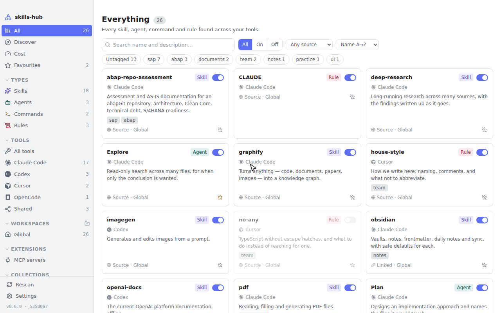
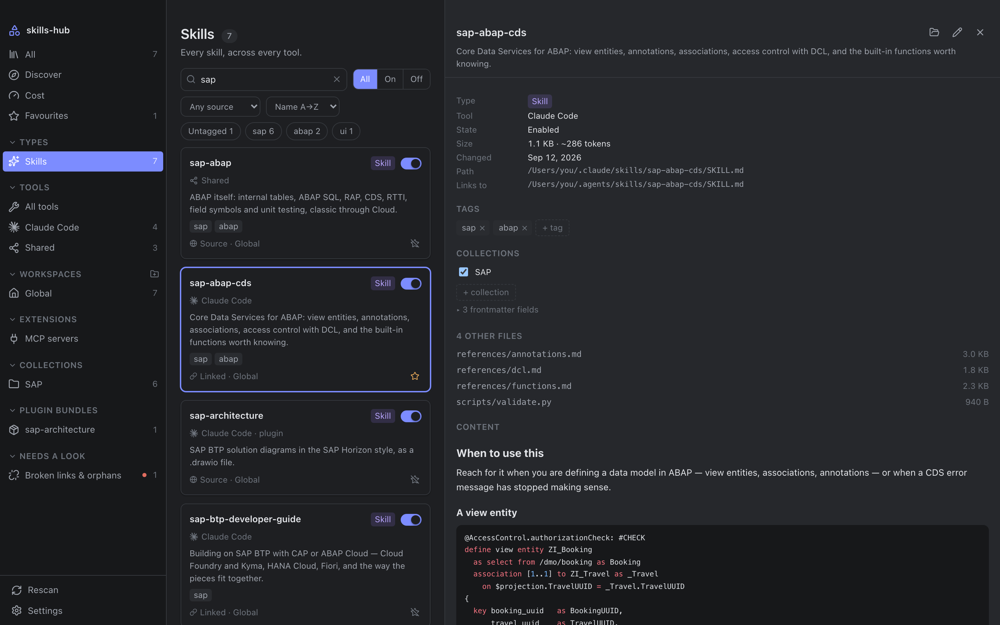
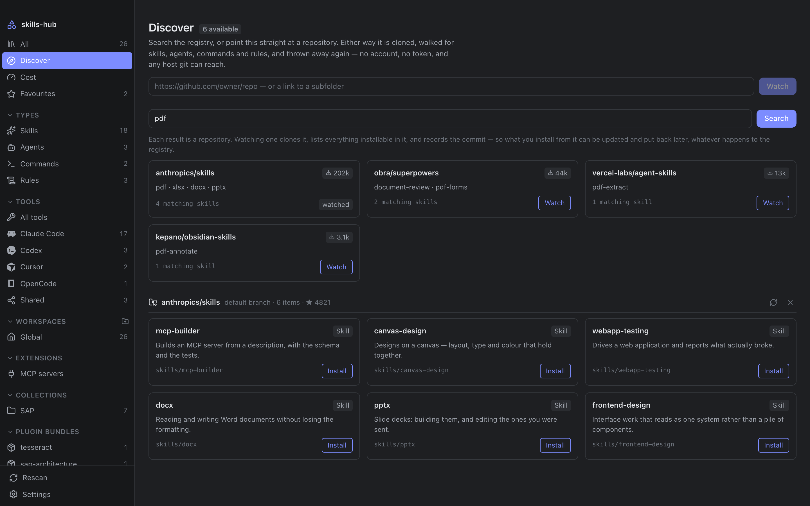
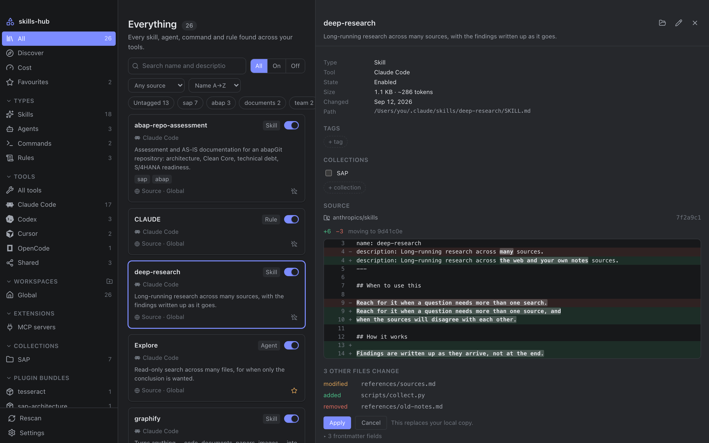
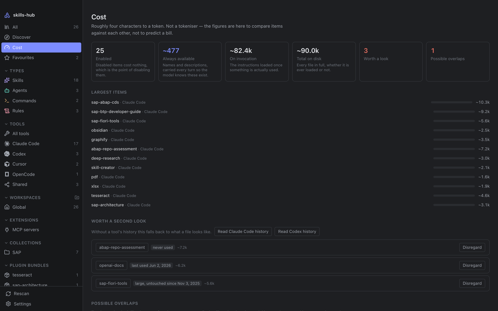
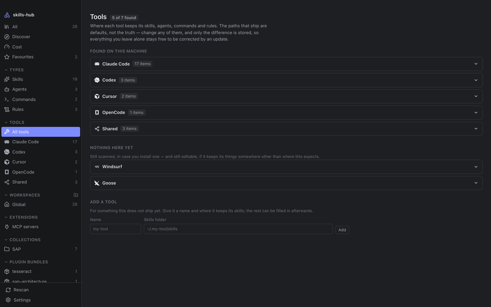
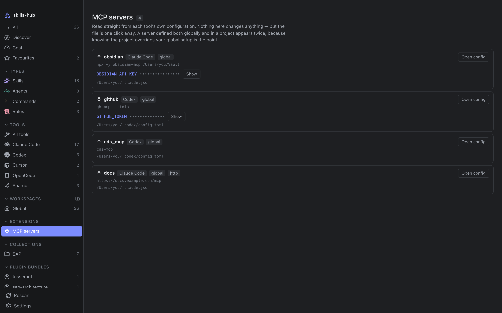
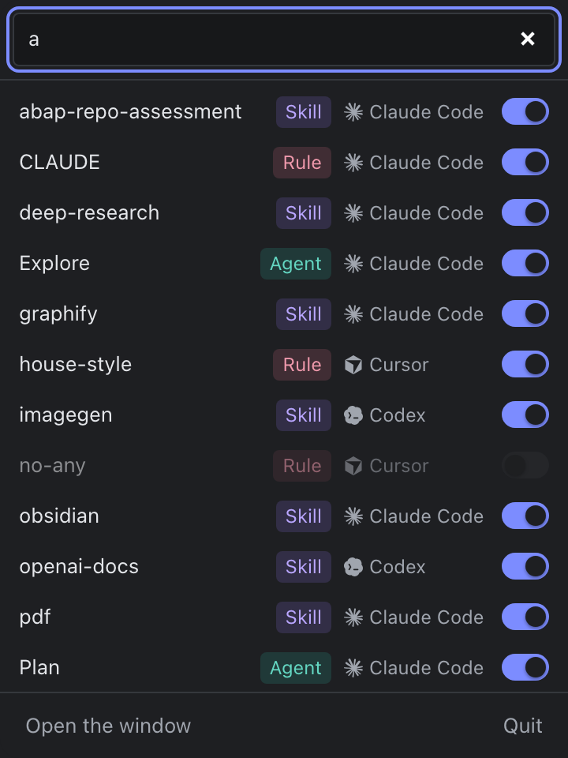

<div align="center">


# skills-hub

**One library for the skills, agents, commands and rules<br>scattered across every AI coding tool you use.**

[](https://github.com/nimble-123/skills-hub/releases/latest)
[](https://github.com/nimble-123/skills-hub/actions/workflows/ci.yml)
[](https://github.com/nimble-123/skills-hub/releases)
[](LICENSE)
<br>
[](#install)
[](#install)
[](#install)
[](https://tauri.app)
[](https://www.rust-lang.org)

[Install](#install) · [Features](#features) · [Supported tools](#supported-tools) · [Changelog](CHANGELOG.md) · [Architecture](ARCHITECTURE.md)

<br>

<picture>
  <source media="(prefers-color-scheme: dark)" srcset="docs/images/tour-dark.gif">
  
</picture>

</div>

<br>

Every AI coding tool keeps its skills, agents, commands and rules in a folder
of its own — some global, some per project, most both. Nothing shows you all of
it at once, the same prompt ends up pasted into three places and drifting
apart, and a checkbox in a manager that never touches the file the tool reads
has not disabled anything.

**skills-hub works on the folders those tools actually read.** Enabling,
disabling and organising act on the real files, never on a copy.

## Features

<table>
<tr>
<td width="50%" valign="top">

### 🗂️ One library, real files
Every tool's items side by side, searchable and filterable by type, tool and
workspace. **Disabling moves the file** into a `.skillmanager-disabled` folder
beside it, and enabling moves it back — so the tool genuinely stops seeing it.
Symlink-aware: a relative link is recomputed for its new depth.

</td>
<td width="50%" valign="top">

### 🏷️ Tags that live in your vault
One small markdown note per item, with frontmatter, in a folder you choose. Put
it in an Obsidian vault and your tags sync with everything else and stay
queryable from Dataview. A note carrying your own tags is never removed
automatically.

</td>
</tr>
<tr>
<td valign="top">

### 🔎 Discover, install, diff first
Search the [skills.sh](https://skills.sh) registry, or point it at any
repository git can reach — no account, no token. Everything installed records
the commit it came from, so updates arrive **as a diff before anything is
overwritten**, and can be put back.

</td>
<td valign="top">

### 📊 See what it all costs
What a tool carries every turn — an item's name and description — separated
from what it loads once invoked. Where a tool keeps a history, that history
says which items are actually used.

</td>
</tr>
<tr>
<td valign="top">

### 🧩 MCP servers and plugins
Every MCP server every tool is configured with, global and per project,
read-only. Plugin bundles from Claude Code and Codex, with their items in the
library and the bundle switchable as a whole.

</td>
<td valign="top">

### ⌨️ A menubar companion
On macOS, a status item with a popover: search the whole library, switch an
item on or off, and carry on — the panel takes the keyboard without pulling
you out of your editor.

</td>
</tr>
</table>

And the details: twenty colour palettes, a choice of interface and code fonts,
and a What's new that reads this repository's changelog, filterable by scope.

<details>
<summary><b>Screenshots</b></summary>
<br>

| | |
|---|---|
|  |  |
|  |  |
|  |  |

<p align="center">
  
</p>

</details>

## Supported tools

Claude Code · Cursor · Codex · OpenCode · Antigravity · GitHub Copilot ·
Cline · Trae · Windsurf · Goose · Hermes · Pi · Gemini CLI · Roo Code ·
Continue · and the shared `~/.agents/skills` convention.

Every path is editable, so a tool that moves its folders — or a setup that was
never standard — does not have to wait for a release.

## Install

| Platform | Install |
|---|---|
| **macOS** — universal, Apple silicon and Intel | `brew install --cask nimble-123/tap/skills-hub` |
| **Windows** | `winget install nimble-123.skills-hub` |
| **Linux** | the `.deb` or `.AppImage` from the [latest release](https://github.com/nimble-123/skills-hub/releases/latest) |

The winget manifest is [in review](https://github.com/microsoft/winget-pkgs/pull/442854);
until it is merged, take the `-setup.exe` from the
[latest release](https://github.com/nimble-123/skills-hub/releases/latest),
where every installer above comes from.

On first launch it asks where to keep its notes. Your skills are never moved
or copied — only those notes live there.

<details>
<summary><b>macOS says the app cannot be opened</b></summary>
<br>

Builds are not signed yet, and Homebrew quarantines what it downloads like any
browser would. Open the app, let it be refused, then allow it under
**System Settings → Privacy & Security**, where an **Open Anyway** button now
sits. Or take the quarantine flag off yourself:

```bash
xattr -dr com.apple.quarantine /Applications/skills-hub.app
```

Control-clicking the app and choosing Open no longer works — macOS 15 removed
that bypass. The flag is set when a file is *downloaded*, so a build carried
over on a USB stick or with `scp` has none and simply opens.

</details>

<details>
<summary><b>Build from source</b></summary>
<br>

```bash
pnpm install
pnpm tauri build     # → .app and .dmg, or the platform's equivalent
```

</details>

## Architecture

Three layers, dependencies pointing inwards only:

| Layer | Path | Knows about |
|---|---|---|
| UI | `src/` | `src/bindings.ts` and nothing else |
| Adapter | `src-tauri/` | Tauri and the domain |
| Domain | `crates/core/` | neither of the above |

`skills-core` never imports `tauri` — enforced by `cargo deny`, not by
discipline. `$HOME` is injected rather than read, which is what makes the
scanner testable against temporary directories, and `crates/cli` drives the
same domain code from a terminal as proof that it really is decoupled.

[ARCHITECTURE.md](ARCHITECTURE.md) has the long version, and
[SPEC.md](SPEC.md) what the application guarantees on disk, each guarantee
cited to the test that holds it up.

## Contributing

Issues and pull requests are welcome — [CONTRIBUTING.md](CONTRIBUTING.md) has
the branching model and how a change becomes a release.

<details>
<summary><b>Development commands</b></summary>
<br>

```bash
pnpm install
pnpm tauri dev          # run the app
cargo test --workspace  # domain tests + regenerate src/bindings.ts
cargo clippy --workspace --all-targets -- -D warnings
pnpm check              # Biome: format + lint
pnpm typecheck
pnpm test               # vitest, including a headless render of the window
pnpm icons              # regenerate the icon registry
pnpm screenshots        # regenerate the screenshots
pnpm tour               # regenerate the tour at the top of this page
```

`src/bindings.ts` is generated by `tauri-specta` and committed; CI fails if
`cargo test -p skills-hub` produces a diff.

The screenshots and the tour come from a demo build that swaps only the
modules talking to the host, so they are the real components and the real
stylesheet against fixtures.

```bash
cargo run -p skills-cli -- scan            # the real scanner, real folders
cargo run -p skills-cli -- usage codex     # what a tool's history says
cargo run -p skills-cli -- mcp             # every configured MCP server
```

</details>

## Licence

MIT — see [LICENSE](LICENSE). Derived from the Obsidian plugin
[AI Skills Manager](https://github.com/notenerdofficial/ai-skills-manager);
see [NOTICE.md](NOTICE.md).
