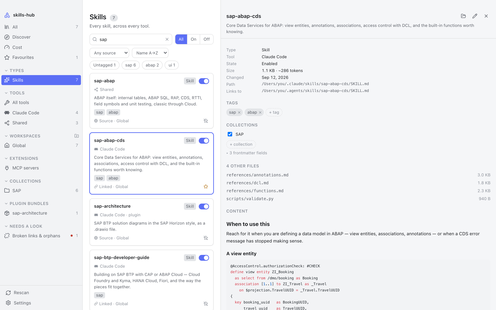
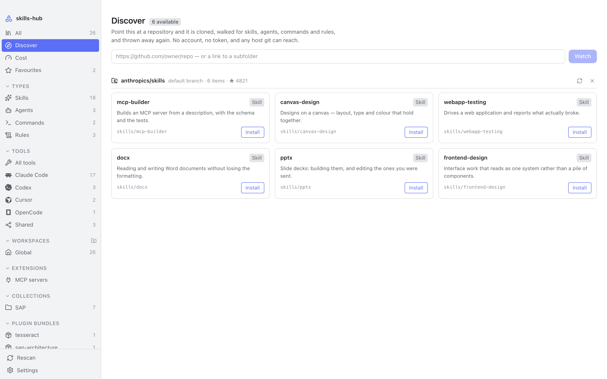
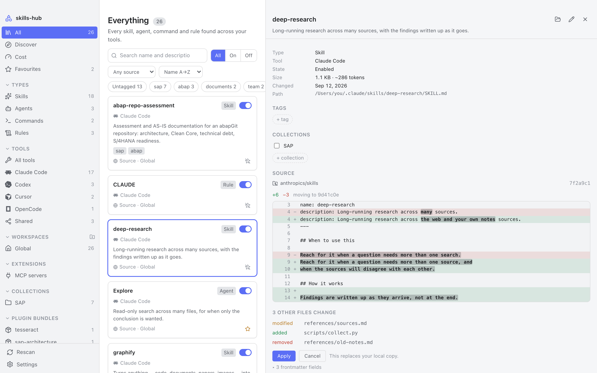
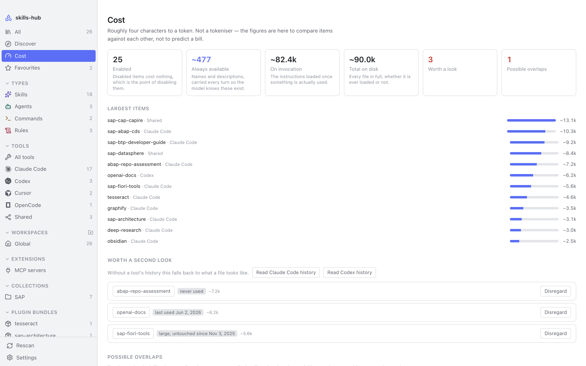
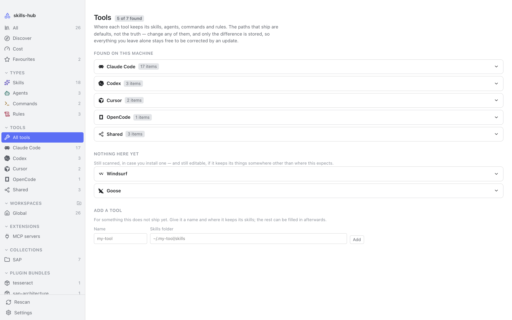

# skills-hub

One library for the skills, agents, commands and rules scattered across every
AI coding tool you use — Claude Code, Cursor, Codex, Gemini CLI and a dozen
more. It works on the folders those tools actually read, so enabling,
disabling and organising act on the real files rather than on a copy.

<p align="center">
  
</p>

A standalone desktop application, built with Tauri and Rust. Derived from the
Obsidian plugin [AI Skills Manager](https://github.com/notenerdofficial/ai-skills-manager);
see [NOTICE.md](NOTICE.md).

## Why

Every tool invents its own convention for where these things live — some
global, some per project, most both. Nothing shows you all of it at once, the
same prompt ends up pasted into three folders and drifting apart, and a
checkbox in a manager that never touches the file the tool reads has not
disabled anything.

So: one library over the real folders, and every action a real one.

## What it does

**Enabling and disabling moves the file.** Into a `.skillmanager-disabled`
folder beside where it was, and back. Symlink-aware — a relative link is
recomputed for its new depth rather than replaced with an absolute path, so a
shared skills folder keeps working after a round trip. The tool genuinely
stops seeing the item.

**Your tags live in your vault.** One small markdown file per item, with
frontmatter, in a folder you choose. Put it in an Obsidian vault and they sync
with everything else you have and stay queryable from Dataview. A note is only
rewritten when something actually changed, and a note carrying your own tags
is never removed automatically.

**Find it, install it, and see the diff first.**

<p align="center">
  
  
</p>

Search the [skills.sh](https://skills.sh) registry by name, or point it at any
repository git can reach — no account and no token either way. A search result
names a repository, and watching one clones it, walks it, and lists everything
installable in it, so the registry is a way to *find* repositories rather than
a second install path that could go stale on its own. Anything installed
records the commit it came from, so it can be checked for updates, shown as a
diff before anything is overwritten, and put back the way it was.

**See what it all costs.**

<p align="center">
  
</p>

What a tool carries every turn — an item's name and description, so the model
knows it exists — separated from what it loads once the item is invoked. Where
a tool keeps a history, that history says which items have actually been used
rather than guessing from how old a file is.

**Everything else it reads, read-only.** Every MCP server every tool is
configured with, global and per project. Plugin bundles from Claude Code and
Codex, with their items in the library and the bundle switchable as a whole.

## Supported tools

Claude Code · Cursor · Codex · OpenCode · Antigravity · GitHub Copilot ·
Cline · Trae · Windsurf · Goose · Hermes · Pi · Gemini CLI · Roo Code ·
Continue · and the shared `~/.agents/skills` convention.

Every path is editable, so a tool that moves its folders — or a setup that was
never standard — does not have to wait for a release.

<p align="center">
  
</p>

## Installing

```bash
pnpm install
pnpm tauri build     # → .app and .dmg
```

Builds are not signed yet, so macOS will object the first time. Open the app,
let it be refused, then allow it under System Settings → Privacy & Security,
where an **Open Anyway** button now sits. Or take the quarantine flag off
yourself:

```bash
xattr -dr com.apple.quarantine skills-hub.app
```

Control-clicking the app and choosing Open no longer works — macOS 15 removed
that bypass. The flag is set when a file is *downloaded*, so a build carried
over on a USB stick or with `scp` has none and simply opens.

On first launch it asks where to keep its notes. Your skills are never moved
or copied — only those notes live there.

## Architecture

Three layers, dependencies pointing inwards only:

| Layer | Path | Knows about |
|---|---|---|
| UI | `src/` | `src/bindings.ts` and nothing else |
| Adapter | `src-tauri/` | Tauri and the domain |
| Domain | `crates/core/` | neither of the above |

`skills-core` never imports `tauri` — enforced by `cargo deny`, not by
discipline. `$HOME` is injected rather than read, which is what makes the
scanner testable against temporary directories. `crates/cli` is a developer
harness that drives the same domain code from a terminal; that it can exist at
all is the proof the domain really is decoupled.

## Development

```bash
pnpm install
pnpm tauri dev          # run the app
cargo test --workspace  # domain tests + regenerate src/bindings.ts
cargo clippy --workspace --all-targets -- -D warnings
pnpm check              # Biome: format + lint
pnpm typecheck
pnpm test               # vitest, including a headless render of the window
pnpm icons              # regenerate the icon registry
pnpm screenshots        # regenerate the pictures above
```

`src/bindings.ts` is generated by `tauri-specta` and committed. Regenerate it
with `cargo test -p skills-hub`; CI fails if doing so produces a diff.

The screenshots come from a demo build that swaps only the three modules
talking to the host, so they are the real components and the real stylesheet
against fixtures. What they cannot show is the native window frame.

```bash
cargo run -p skills-cli -- scan            # the real scanner, real folders
cargo run -p skills-cli -- usage codex     # what a tool's history says
cargo run -p skills-cli -- mcp             # every configured MCP server
```

## Licence

MIT — see [LICENSE](LICENSE).
