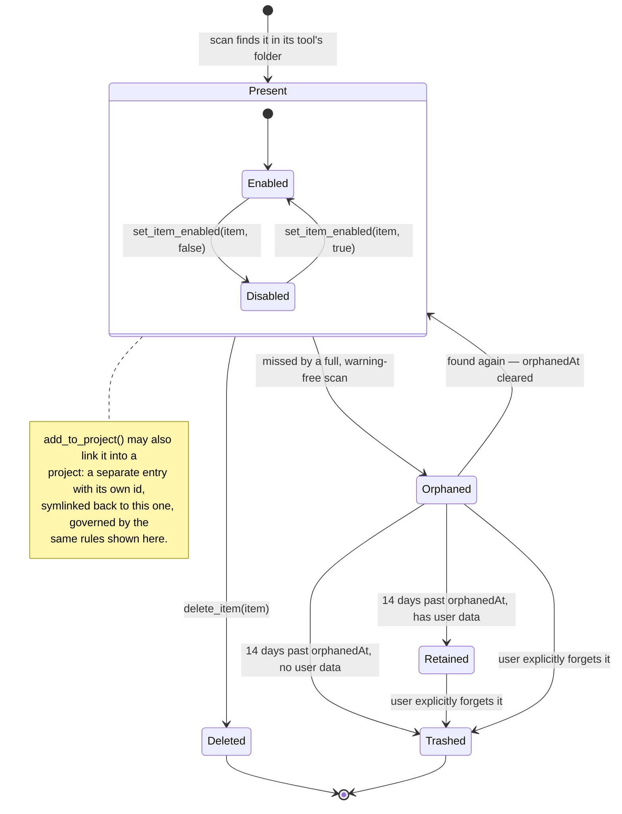

# SPEC.md

A behavioural specification for skills-hub: what it guarantees about the
files it scans, moves, links and deletes, and about the metadata it keeps
alongside them. Not how the code is built — `ARCHITECTURE.md` owns that, and
`README.md` owns why the application exists. Every guarantee below is backed
by a test or, where marked, a code comment making the same promise in prose;
the two diagrams render guarantees already stated and cited around them and
assert nothing of their own. Paths are relative to the repository root; field
and file-format details are not restated here except where a guarantee
depends on them — read the cited source for those.

## Identity

- **An item's identity survives enabling and disabling.** The entry id hashes
  tool, item type, project, plugin, name and path, but strips the
  `.skillmanager-disabled` segment first, so moving an item into or out of
  that folder does not change who it is. (`crates/core/src/ids.rs`,
  `disabling_an_item_does_not_change_its_identity`)
- **Two items of the same name in different directories never collide.** The
  full path is hashed, not a truncated prefix — the Obsidian plugin this is
  derived from truncated its slug to 80 characters, which for a deep path
  could let two unrelated items share one metadata note.
  (`crates/core/src/ids.rs`, `long_paths_sharing_an_eighty_character_prefix_do_not_collide`)
- **Tool, type, project, plugin and name are all part of the identity**; changing
  any one changes the id. (`crates/core/src/ids.rs`,
  `every_component_of_the_tuple_is_part_of_the_identity`)
- **The same real file reached through two different links is two separate
  items, independently toggleable** — collapsing them would make disabling one
  look like disabling both. (`crates/core/tests/scan.rs`,
  `two_paths_to_one_real_file_remain_two_items`)

## Item lifecycle

How one item's state on disk changes, and how its metadata note tracks that.
Every edge below is detailed and cited in the sections that follow.

## Scanning

### What is an item

- **A folder containing `SKILL.md` is the item; a flat `.md` file is the
  item.** No other shape is recognised; a folder without a manifest is
  descended into as a category, which is what makes
  `skills/engineering/tdd/SKILL.md` work. (`crates/core/src/scan/mod.rs`,
  `crates/core/tests/scan.rs::descends_into_a_folder_that_is_not_itself_a_skill`)
- **`SKILL.md` is case-sensitive**; a `skill.md` is an ordinary flat file, not
  a manifest, matching the tools themselves. (`crates/core/src/fsunit.rs::the_manifest_name_is_case_sensitive`)
- **A `.md` extension is matched case-insensitively** — macOS's filesystem is,
  and so are the tools. (`crates/core/src/scan/mod.rs`)
- **A name comes from frontmatter, falling back to the file or folder name
  when frontmatter declares none.** (`crates/core/tests/scan.rs::falls_back_to_the_folder_name_when_frontmatter_declares_none`)
- **A compound suffix — `.instructions.md`, `.prompt.md` — is stripped whole**,
  not just the extension, so Copilot's `foo.instructions.md` is named `foo`.
  (`crates/core/tests/scan.rs::strips_a_compound_suffix_whole_rather_than_only_the_extension`)
- **A non-markdown file beside items in a flat folder is ignored.**
  (`crates/core/tests/scan.rs::finds_flat_markdown_files`)

### Traversal limits

- **The item scan descends at most four levels below a configured root** —
  generous for any category layout seen in practice, and a ceiling against a
  mis-configured path (someone's whole home directory, a monorepo) turning
  into a full-disk crawl. (`crates/core/src/scan/mod.rs::MAX_SCAN_DEPTH`,
  `crates/core/tests/scan.rs::stops_descending_past_the_depth_limit`)
- **The broken-symlink scan descends one level deeper (five)**, since a
  manifest inside a skill folder can itself be the dangling link.
  (`crates/core/src/scan/broken.rs::MAX_DEPTH`)
- **`node_modules` and `.git` are never descended into**, by either scan.
  (`crates/core/tests/scan.rs::never_descends_into_node_modules_or_git`)
- **A symlink loop does not repeat items or hang** — real paths of directories
  already entered are tracked. (`crates/core/tests/scan.rs::a_symlink_loop_does_not_repeat_items`)
- **A configured "directory" that is actually a file is not an error** — Cline
  once used a single `.clinerules` file where every other tool uses a folder.
  (`crates/core/tests/scan.rs::a_configured_path_that_is_a_file_is_not_an_error`)
- **A configured root that does not exist yields neither items nor warnings.**
  (`crates/core/tests/scan.rs::a_missing_root_produces_neither_items_nor_warnings`)

### Enabled and disabled

- **The scanner pairs enabled and disabled folders at every level it visits,
  not only at the configured root** — a `.skillmanager-disabled` folder
  inside a category is found there, since an enabled-only walk skips it by
  name and a root-only disabled pass would miss it entirely.
  (`crates/core/tests/scan.rs::finds_an_item_disabled_inside_a_category_folder`)
- **Nothing is treated as disabled inside a disabled folder** — a nested
  `.skillmanager-disabled` folder is not descended into a second time.
  (`crates/core/tests/scan.rs::nothing_is_disabled_within_a_disabled_folder`)

### Single-file rules

- **A tool whose rule path names one file (`CLAUDE.md`, `AGENTS.md`) treats
  that file as the whole item**, not a directory of items; its disabled twin
  sits wherever the generic move puts any lone file.
  (`crates/core/tests/scan.rs::reads_a_single_instructions_file_as_one_item`,
  `finds_a_disabled_instructions_file_beside_its_enabled_position`)
- **A missing instructions file yields nothing, not an error.**
  (`crates/core/tests/scan.rs::a_missing_instructions_file_yields_nothing_rather_than_an_error`)
- **A single-file rule is never offered as an install target** — it is the
  user's own memory, not a thing to install into. (`crates/core/src/paths.rs::a_single_file_rule_is_not_an_install_target`)

### Symlinks during scanning

- **The item scan follows symlinks — a linked-in skill is a skill** — and
  records both `source_path` (where found) and `real_path` (where it really
  lives). (`crates/core/tests/scan.rs::follows_a_symlinked_skill_and_records_where_it_really_lives`)
- **A dangling symlink is skipped by the item scan rather than failing it.**
  (`crates/core/tests/scan.rs::a_dangling_symlink_is_skipped_rather_than_failing_the_scan`)
- **Broken symlinks are found by a separate walk**: the item scan calls
  `metadata` (follows a link, so cannot see a dangling one) while the
  broken-link walk calls `symlink_metadata` (does not follow) and then checks
  whether the target exists. (`crates/core/src/scan/broken.rs`)
- **A link that resolves is never reported as broken**, and is deliberately
  not descended into by the broken-link walk — following it here risks a
  loop, and a working link is the item scan's business.
  (`crates/core/tests/plugins_and_broken.rs::a_link_that_resolves_is_not_reported`)
- **A dangling link inside the disabled folder is still reported** — the user
  parked that item on purpose; a link pointing nowhere is the same problem
  wherever it sits. (`crates/core/tests/plugins_and_broken.rs::a_dangling_link_inside_the_disabled_folder_is_still_reported`)
- **A broken link found inside a project names that project.**
  (`crates/core/tests/plugins_and_broken.rs::reports_a_dangling_link_in_a_project_and_names_the_project`)

### Unreadable folders

- **A folder the scan cannot read is recorded as a warning (permission
  denied, or otherwise unreadable), never silently dropped** — a scan that
  quietly returned less than it should must not look identical to one that
  found nothing, which is the distinction pruning relies on (see Pruning
  notes, below). (`crates/core/src/model.rs::ScanWarning`,
  `crates/core/src/scan/mod.rs::warn`)

### Project scope

- **An item found inside a project carries that project's id**, and the same
  skill scanned globally and inside a project gets two different entry ids.
  (`crates/core/tests/scan.rs::a_project_scan_tags_items_with_the_project_id`,
  `the_same_skill_globally_and_in_a_project_gets_different_ids`)
- **A user can add extra rule paths beyond a tool's one configured location**,
  scanned like any other root. (`crates/core/tests/scan.rs::scans_an_extra_rule_path_the_user_added`)

### Plugin bundles

- **A tool marked disabled in settings is still scanned** — skipping it would
  make every one of its items look deleted, and the metadata store would then
  be entitled to discard the user's tags for all of them.
  (`crates/core/src/scan/mod.rs::scan_tool`)
- **Absence from a tool's `enabledPlugins` map means enabled** — the file only
  records decisions the user actually made. (`crates/core/tests/plugins_and_broken.rs::finds_a_registry_plugin_and_the_skills_inside_it`)
- **Disabling a plugin bundle makes every item inside it report disabled**,
  regardless of which folder the item's own file sits in.
  (`crates/core/tests/plugins_and_broken.rs::a_plugin_switched_off_in_settings_reports_as_disabled`)
- **A Codex cached bundle counts only where its `.codex-plugin` marker file is
  present** — a marketplace source tree is not mistaken for an installed one
  — and where several versions sit mid-update, the first found wins.
  (`crates/core/tests/plugins_and_broken.rs::finds_a_cached_bundle_only_where_the_marker_file_is`)
- **A missing or malformed plugin registry yields no plugins, not an error.**
  (`crates/core/tests/plugins_and_broken.rs::a_missing_or_malformed_registry_yields_no_plugins_rather_than_an_error`)
- **A plugin's repository is accepted from its manifest only when it is a
  GitHub URL** — a half-usable value would be worse than none.
  (`crates/core/tests/plugins_and_broken.rs::reads_a_github_repository_from_the_manifest_and_rejects_anything_else`)
- **A bundle can lay a type out in a different subfolder than the tool's own
  global layout** — Codex's global commands live in `prompts/`, a bundle's in
  `commands/`. (`crates/core/tests/plugins_and_broken.rs::a_bundle_lays_commands_out_where_the_tool_says_it_does`)
- **A plugin's items are toggled and deleted only as a whole bundle**, never
  individually — see Toggling and deleting.

## Toggling and deleting

Enable, disable and delete are the only operations that destroy anything on
disk, and three rules govern all of them (`crates/core/src/toggle.rs`):

1. **Create before destroying** — the new entry is made and verified before
   the old one is removed; there is no instant at which neither exists.
2. **A symlink is re-pointed, never followed**, and removed with a
   link-specific call, never a recursive directory removal.
3. **Nothing is overwritten** — a name already taken at the destination is
   refused, not silently resolved.

- **Disabling moves an item's whole unit — a skill's entire folder including
  companions, or a lone file — into a `.skillmanager-disabled` folder beside
  where it was; enabling moves it back to exactly where it was.**
  (`crates/core/tests/toggle.rs`, `disabling_a_flat_file_moves_it_into_the_disabled_folder`,
  `a_skill_folder_travels_whole`, `enabling_it_again_puts_it_back_exactly_where_it_was`)
- **An item inside a category folder is disabled beside its own neighbours in
  that category, not at the tool's configured root** (the write side of the
  pairing rule scanning relies on, above).
  (`crates/core/tests/toggle.rs::an_item_in_a_category_folder_is_disabled_beside_its_own_neighbours`)
- **Toggling is idempotent**: asking for the state an item is already in does
  nothing and succeeds, and disabling twice moves nothing the second time —
  a double click or a retry cannot leave an item flipped the wrong way.
  (`crates/core/tests/toggle.rs`, `asking_for_the_state_it_is_already_in_does_nothing`,
  `disabling_twice_is_not_an_error_and_moves_nothing_the_second_time`)
- **A name already taken at the destination is an error, and neither file is
  touched.** (`crates/core/tests/toggle.rs::a_name_already_taken_is_an_error_and_nothing_is_overwritten`)
- **An item that belongs to a plugin can be neither toggled nor deleted
  through this path** — the whole plugin must be switched off instead.
  (`crates/core/tests/toggle.rs::an_item_from_a_plugin_can_neither_be_toggled_nor_deleted`)
- **A relative symlink is recomputed for its new depth on every move and
  stays relative; an absolute link stays absolute.** Carrying a relative
  target across unchanged would point one level off; making it absolute
  instead would break the moment the home directory has a different name —
  exactly what a relative link exists to survive.
  (`crates/core/tests/toggle.rs`, `a_relative_link_is_recomputed_for_its_new_depth_and_stays_relative`,
  `an_absolute_link_stays_absolute`)
- **A relative link to a whole skill folder still resolves after the move**,
  and the skill it points at is never itself touched by disabling the link.
  (`crates/core/tests/toggle.rs`, `a_relative_link_to_a_skill_folder_still_resolves_after_the_move`,
  `the_skill_a_link_points_at_is_never_touched`)
- **Moving one of several links to the same target leaves the others reading
  through correctly**, and a link survives a full disable-then-enable round
  trip reading exactly as it did before. (`crates/core/tests/toggle.rs`,
  `moving_one_of_several_links_to_the_same_target_leaves_the_others_alone`,
  `a_link_survives_a_full_round_trip`)
- **A relocated symlink's new location is checked before the original is
  removed**; if it does not resolve to the same target, the move aborts
  rather than deleting the original. Not test-covered — see the closing
  section. (`crates/core/src/toggle.rs::relocate_symlink`)
- **Deleting a flat file or a skill folder removes it entirely.**
  (`crates/core/tests/toggle.rs`, `deleting_a_flat_file_removes_it`, `deleting_a_skill_removes_the_whole_folder`)
- **Deleting a project link removes only the link, never the skill it points
  at** — see Cross-cutting for how a directory symlink is always removed
  without touching its target. (`crates/core/tests/toggle.rs::deleting_a_project_link_removes_the_link_and_not_the_skill`)
- **Switching a whole plugin on or off writes into the owning tool's own
  settings file, preserving every other key in it** — a plugin with no
  recorded decision yet can still be switched off; a tool with no usable
  settings file says so rather than inventing one. (`crates/core/tests/toggle.rs`,
  `switching_a_plugin_off_records_it_without_disturbing_other_settings`,
  `a_plugin_with_no_recorded_decision_can_still_be_switched_off`,
  `a_tool_with_no_settings_file_says_so_rather_than_inventing_one`)
- **A move across a filesystem boundary copies then removes the original,
  only after the copy succeeds** — an interruption leaves two copies, never
  none. (`crates/core/src/toggle.rs::copy_then_remove`)
- **Deleting an item is a real filesystem removal, not a move to the trash.**
  Only the metadata store's own pruning (see Pruning notes) sends anything to
  the OS trash; `toggle::delete_item` calls `remove_file` /
  `remove_dir_all` / a link-specific removal directly.
  (`crates/core/src/toggle.rs::delete_item`)

## Linking into a project

`crates/core/src/projectlink.rs`.

- **Linking is always by symlink, never by copy** — a copy is a second thing
  to keep in step with the first, and removing a link takes nothing from the
  original. (`crates/core/src/projectlink.rs`)
- **A link is created using the same path resolution the scanner uses**, so it
  lands where the tool will actually look — the Obsidian plugin this is
  derived from stripped `~/` off the global path instead, which for Copilot
  put a rule at `.copilot/instructions` when the project convention is
  `.github/instructions`, a folder nothing reads.
  (`crates/core/tests/projectlink.rs::honours_a_tools_project_path_rather_than_deriving_it`)
- **A link points at where the item really lives, never at another link** —
  chaining through an intermediate link would break as soon as any hop
  moved. (`crates/core/tests/projectlink.rs::links_through_to_where_the_item_really_lives`)
- **Linking is idempotent**: linking something already linked changes
  nothing. (`crates/core/tests/projectlink.rs::linking_twice_changes_nothing`)
- **Unlinking removes only the link and leaves the skill untouched**;
  unlinking anything that is not itself a symlink is refused, so this path
  can never become a way to delete a real item by accident.
  (`crates/core/tests/projectlink.rs`, `unlinking_removes_the_link_and_leaves_the_skill`,
  `unlinking_something_that_is_not_a_link_is_refused`)
- **A tool with nowhere in a project to put a given item type says so**,
  rather than guessing a location. (`crates/core/tests/projectlink.rs::a_tool_with_nowhere_to_put_it_says_so`)
- **A linked item is found by a subsequent project scan**, tagged with that
  project's id. (`crates/core/tests/projectlink.rs::the_project_scan_then_finds_the_linked_item`)

## Metadata notes

`crates/core/src/store/` — one markdown note per item.

- **One note file exists per item, named after its entry id.**
  (`crates/core/tests/store.rs::creates_one_note_per_item_named_after_its_id`)
- **A note is written only when something in it would actually change** — not
  even a matching rescan touches the file's mtime. `lastScanned` alone does
  not count as a change, so a synced or version-controlled notes folder is
  never shown as fully modified after a routine scan.
  (`crates/core/tests/store.rs::a_second_scan_that_found_the_same_thing_writes_nothing`)
- **A changed derived field — description, enabled state, and so on — is
  written through on the next scan**, while tags, favourites and collections
  are never touched by a scan. (`crates/core/tests/store.rs`,
  `a_changed_description_is_written_through`, `a_rescan_does_not_disturb_tags_favourites_or_collections`)
- **An edit made outside the application survives the next scan** — a
  hand-added tag, hand-written prose, or a frontmatter key the application
  does not itself recognise. (`crates/core/tests/store.rs`,
  `an_edit_made_outside_the_application_survives_the_next_scan`,
  `an_unknown_frontmatter_key_survives_a_rescan`)
- **Notes are written atomically**, through a temporary file in the same
  directory and a rename, so a reader — Obsidian, a sync client — never sees
  a half-written note. (`crates/core/src/store/mod.rs::write`)
- **A tag update trims, de-duplicates case-insensitively, keeps the first
  casing seen, and preserves order.** (`crates/core/tests/store.rs::tags_are_trimmed_and_de_duplicated_without_being_reordered`)
- **Updating an item that was never scanned is an error, not a new note.**
  (`crates/core/tests/store.rs::updating_something_that_was_never_scanned_is_an_error_not_a_new_note`)
- **A markdown file in the notes folder this application did not write is
  left alone entirely**, reported separately as "foreign" rather than parsed
  or adopted. (`crates/core/tests/store.rs::a_markdown_file_that_is_not_ours_is_left_alone`)
- **A note whose `enabled` key is missing reads as enabled** — a note nobody
  can classify describes an item that is present; hiding it would be the
  more surprising error. (`crates/core/src/store/note.rs::a_missing_enabled_key_reads_as_enabled`)
- **Provenance fields are left out of the file entirely until there is a
  value to write**, rather than appearing empty. (`crates/core/src/store/note.rs::provenance_is_left_out_of_the_file_until_there_is_any`)

### Pruning notes

`crates/core/src/store/prune.rs`. The question is never "was it found?" but
"is this scan entitled to conclude it is gone?" — a scan can miss an item for
reasons that have nothing to do with the item: an unmounted volume, a folder
macOS withheld consent for, a tool mid-reinstall.

```mermaid
flowchart TD
    A[A scan runs] --> B{Every tool and<br/>project covered?}
    B -- no --> X[Prunes nothing — PartialScan]
    B -- yes --> C{Any folder<br/>unreadable?}
    C -- yes --> Y[Prunes nothing — ScanHadWarnings]
    C -- no --> D{Found anything<br/>at all?}
    D -- no --> Z[Prunes nothing — ScanFoundNothing]
    D -- yes --> E{This note's item found,<br/>or its symlink merely broken?}
    E -- yes --> F[Kept — ensure&#40;&#41; already<br/>cleared orphanedAt if set]
    E -- no --> G{Already marked<br/>orphanedAt?}
    G -- no --> H[Mark orphanedAt now —<br/>nothing deleted]
    G -- yes --> I{14 days past<br/>orphanedAt?}
    I -- no --> J[Left alone]
    I -- yes --> K{Note has user data?<br/>tags, favourite, collections, …}
    K -- yes --> L[Retained — listed for<br/>the user to decide]
    K -- no --> M[Moved to the OS trash]
```

- **Prunes nothing unless the scan was full, warning-free, and found at least
  one item** — partial, warning-carrying or wholly-empty scans are never
  evidence of absence. (`crates/core/tests/store.rs`, `a_partial_scan_prunes_nothing`,
  `a_scan_that_could_not_read_something_prunes_nothing`, `a_scan_that_found_nothing_at_all_prunes_nothing`)
- **A missing item is marked orphaned before it is ever removed** — the first
  miss only sets `orphanedAt`. (`crates/core/tests/store.rs::a_missing_item_is_marked_before_it_is_ever_removed`)
- **An orphaned note waits fourteen days (`ORPHAN_GRACE`) before it can be
  trashed**, and is untouched if found again in the meantime, which clears
  the marker. (`crates/core/src/store/prune.rs::ORPHAN_GRACE`,
  `crates/core/tests/store.rs`, `a_note_is_not_removed_before_the_grace_period_is_up`,
  `an_item_that_comes_back_stops_being_an_orphan`)
- **Past the grace period, a note carrying anything the user put there — a
  tag, a favourite, a collection, provenance, or an unrecognised key — is
  never auto-deleted**; it is listed for the user to decide instead.
  (`crates/core/tests/store.rs::a_note_carrying_user_data_is_never_removed_automatically`)
- **An item behind a currently broken symlink keeps its note without even
  being marked orphaned** — the file is visibly there, just broken.
  (`crates/core/tests/store.rs::an_item_whose_symlink_is_broken_keeps_its_note`)
- **The user can explicitly forget an orphan**, trashing its note regardless
  of grace period or user data. (`crates/core/tests/store.rs::the_user_can_let_an_orphan_go`)
- **Anything the store removes goes to the OS trash, never straight
  deletion**; a trash failure leaves the note in place.
  (`crates/core/src/store/prune.rs`)
- **A timestamp that cannot be parsed counts as not past the grace period** —
  a note nobody can date is not a note to delete. (`crates/core/src/store/prune.rs::past_grace`)

## Installing, updating and restoring

`crates/core/src/install.rs`.

- **Install refuses to overwrite anything already at the destination name**,
  and installs nothing if it would. (`crates/core/tests/install.rs::refuses_to_overwrite_something_already_there`)
- **What lands on disk is plain files: the clone's `.git` directory is
  stripped before anything is copied out**, so an installed item never
  becomes a nested checkout. (`crates/core/tests/install.rs::what_lands_on_disk_has_no_repository_in_it`)
- **Installing a folder skill copies the whole folder, companions included;
  installing a flat file copies the file**, into either the home directory or
  a specific project. (`crates/core/tests/install.rs`,
  `installs_a_folder_skill_where_the_tool_reads_it`, `installs_a_flat_file`,
  `installs_into_a_project_when_asked`)
- **Installing an empty subpath (the whole repository) names the item after
  the repository.** (`crates/core/tests/install.rs::names_a_whole_repository_after_the_repository`)
- **A subpath that does not exist in the repository fails outright and
  installs nothing.** (`crates/core/tests/install.rs::a_subpath_that_is_not_there_says_so_and_installs_nothing`)
- **What was installed records the repository, ref, subpath and exact
  commit** — the entire basis for checking updates, diffing, and restoring.
  (`crates/core/tests/install.rs::records_where_it_came_from_so_it_can_be_updated_later`)
- **An item is reported `Current` until the remote branch moves on, `Stale`
  once it has, and `Untracked` for anything not installed through this
  application** — an untracked item is never checked against a remote.
  (`crates/core/tests/install.rs`, `says_an_item_is_current_until_the_remote_moves_on`,
  `an_item_nobody_installed_is_not_checked_at_all`)
- **A review shows what an update or restore would change before anything on
  disk is touched** — a real line-level diff for the manifest, an
  added/removed/modified verdict for every other file, computed but not
  applied. (`crates/core/tests/install.rs::a_review_shows_what_would_change_before_anything_does`)
- **If the tracked commit moved on but this item's content did not, the
  review says so rather than showing an empty diff** — a repository holding
  many skills moves on for reasons that can have nothing to do with any one
  of them. (`crates/core/tests/install.rs::says_when_the_commit_moved_but_this_item_did_not`)
- **Applying a review replaces the local copy wholesale**; a file the update
  removed upstream is gone locally too, not left behind.
  (`crates/core/tests/install.rs::applying_a_review_replaces_the_local_copy`)
- **Restoring an item brings back the exact commit it was installed at** —
  see Talking to git for how an exact commit is fetched even though every
  other clone here is shallow. (`crates/core/tests/install.rs::restoring_brings_back_the_commit_it_was_installed_at`)
- **Reviewing an item with no recorded install provenance is refused
  outright.** (`crates/core/tests/install.rs::reviewing_something_that_was_never_installed_from_anywhere_is_refused`)

## Discovering installable items in a repository

`crates/core/src/discover.rs` — no GitHub API, no permanent clone.

- **What something is comes from where it sits, never from what is in it.** A
  folder holding `SKILL.md` is a skill; a markdown file inside a folder named
  `agent(s)`, `command(s)`, `prompt(s)` or `rules` is one of those, and the
  type carries down into subfolders. (`crates/core/tests/discover.rs`,
  `reads_the_type_from_the_folder_it_is_in`, `the_type_carries_down_into_subfolders`)
- **A loose markdown file with nothing declaring what it is — no typed
  folder, no `SKILL.md` beside it — is not counted as an item.**
  (`crates/core/tests/discover.rs::a_loose_markdown_file_with_nothing_saying_what_it_is_is_not_an_item`)
- **A skill's own companion files are never separate items** — its
  `references/`, its own nested `commands/`, are not walked as items.
  (`crates/core/tests/discover.rs::a_skills_own_files_are_not_separate_items`)
- **Dot-folders are searched, unlike `node_modules` and `.git`** — Copilot
  keeps prompts under `.github/`, a Claude plugin's manifest under
  `.claude-plugin/`. (`crates/core/tests/discover.rs`, `looks_inside_dot_folders`,
  `never_looks_inside_node_modules_or_git`)
- **A subpath can point straight at one skill's folder or one markdown
  file, and finds exactly that item** — the natural result of pasting a link
  to a single skill. A subpath absent from the repository is refused.
  (`crates/core/tests/discover.rs`, `a_subpath_pointing_straight_at_a_skill_finds_it`,
  `a_subpath_pointing_straight_at_a_markdown_file_finds_it`, `a_subpath_that_is_not_there_says_so`)
- **A repository with nothing installable yields an empty result, never a
  failure.** (`crates/core/tests/discover.rs::a_repository_with_nothing_installable_yields_nothing_rather_than_failing`)
- **The same repository, branch and subpath is always the same source
  identity.** (`crates/core/tests/discover.rs::the_same_repository_branch_and_subpath_is_the_same_source`)
- **Re-fetching a watched source replaces everything previously known about
  it** — an item since gone from the repository disappears from the
  catalogue too. (`crates/core/tests/discover.rs::refetching_a_source_replaces_what_was_known_about_it`)
- **Removing a watched source takes every entry it produced with it, and two
  watched sources keep fully independent entries.**
  (`crates/core/tests/discover.rs`, `removing_a_source_takes_its_entries_with_it`,
  `two_sources_keep_their_own_entries`)
- **An unreadable discover catalogue file starts empty rather than refusing
  to open** — nothing in it cannot be found again simply by re-adding the
  repository. (`crates/core/src/discover.rs::CatalogFile::load`)

## Talking to git

`crates/core/src/git.rs` — every operation clones into a throwaway temporary
directory and discards it; nothing here keeps a permanent working copy.

- **Any single git command is killed after 45 seconds, and credential
  prompting is disabled outright** (`GIT_TERMINAL_PROMPT=0` and equivalents),
  so a repository that wants credentials fails fast instead of hanging with
  nothing able to answer the prompt. (`crates/core/src/git.rs::TIMEOUT`,
  `crates/core/tests/git.rs::a_repository_needing_credentials_fails_rather_than_hanging`)
- **A clone deletes itself as soon as it goes out of scope, including on an
  early return** — the temporary directory is owned by the clone value
  itself. (`crates/core/tests/git.rs::the_clone_is_deleted_when_it_goes_out_of_scope`)
- **An empty ref name means the repository's default branch.**
  (`crates/core/tests/git.rs::an_empty_ref_means_the_default_branch`)
- **A subpath that would climb out of a clone (`../`) is refused.**
  (`crates/core/tests/git.rs::refuses_a_subpath_that_climbs_out_of_the_clone`)
- **A branch or repository that does not exist fails with an error carrying
  git's own message**, not a generic one. (`crates/core/tests/git.rs`,
  `a_branch_that_is_not_there_is_an_error_rather_than_an_empty_answer`,
  `a_repository_that_is_not_there_fails_with_what_git_said`)
- **Restoring an exact historical commit works even though every other clone
  is shallow and can otherwise only see a branch's tip**, by fetching that one
  commit directly. A host that will not hand over an arbitrary commit fails
  with a message pointing at checking for updates instead; a commit id that
  is not a real hex identifier is refused before any git command runs.
  (`crates/core/tests/git.rs`, `fetches_one_exact_commit_for_a_restore`,
  `a_commit_the_host_will_not_hand_over_says_so`,
  `something_that_is_not_a_commit_id_is_refused_before_anything_runs`)

## Settings

`crates/core/src/settings.rs` — the settings file is an overlay on the
compiled-in tool registry, holding only what a user may override.

- **A settings file written by an older version can never shadow a field the
  current registry knows about.** This is structural, not a maintained
  whitelist — the Obsidian plugin this is derived from stored whole tool
  objects and once shipped an incomplete field list that silently broke
  project paths for everyone. (`crates/core/tests/settings.rs::a_settings_file_written_by_an_older_version_cannot_shadow_the_registry`)
- **Overriding one type's path for a tool leaves every other type's path,
  and every field the override does not name, untouched.**
  (`crates/core/tests/settings.rs::an_override_of_one_path_does_not_disturb_the_others`)
- **An empty-string path override explicitly turns that item type off**,
  distinct from no override at all (which uses the shipped default).
  (`crates/core/tests/settings.rs::an_empty_path_turns_that_type_off_entirely`)
- **A tool the user has disabled stays in the effective tool list**, so it
  can still be scanned — removing it outright would make every item of that
  tool look deleted to the metadata store.
  (`crates/core/tests/settings.rs::a_disabled_tool_is_still_in_the_list_so_it_can_still_be_scanned`)
- **A custom tool the shipped registry later adopts under the same id defers
  to the registry's version.** (`crates/core/tests/settings.rs::a_custom_tool_the_registry_has_since_adopted_does_not_appear_twice`)
- **A reordered sidebar stays exactly as the user left it.** A section added
  by a later release appears at its default relative position rather than
  vanishing or landing arbitrarily at the end; a section that no longer
  exists is dropped. (`crates/core/tests/settings.rs`,
  `a_reordered_sidebar_is_kept_as_the_user_left_it`,
  `a_section_added_by_an_update_appears_at_its_default_position`,
  `a_section_that_no_longer_exists_is_dropped`)
- **A theme value written before the palette list grew still loads
  correctly**, even though the naming scheme changed from `lowercase` to
  `kebab-case` — the values that existed before spell the same either way.
  (`crates/core/tests/settings.rs::a_theme_written_before_the_palettes_grew_still_loads`)
- **A missing settings file means defaults, not an error**, and a corrupt one
  is quarantined — moved aside with a timestamped name — rather than
  blocking startup. (`crates/core/tests/settings.rs`,
  `a_missing_file_means_defaults_rather_than_an_error`,
  `a_corrupt_file_is_set_aside_and_the_application_still_starts`)
- **Every save keeps one copy of the previous good file**, as
  `settings.backup.json`. (`crates/core/tests/settings.rs::saving_keeps_a_copy_of_the_last_good_file`)
- **The written settings file is pretty-printed, hand-editable, and contains
  none of the registry's own fields.** (`crates/core/tests/settings.rs::the_written_file_is_readable_and_hand_editable`)
- **Settings, the discover catalogue and dismissals are all written
  atomically**, the same temp-file-then-rename pattern as metadata notes.
  (`crates/core/src/settings.rs::SettingsFile::save`,
  `crates/core/src/discover.rs::CatalogFile::save`,
  `crates/core/src/dashboard.rs::DismissalsFile::save`)

## MCP configuration

`crates/core/src/mcp.rs` — read-only; editing another tool's own
configuration is not attempted.

- **A server defined both globally and inside a project appears as two
  separate entries, never collapsed** — seeing that a project overrides the
  global setup is exactly why this page exists. (`crates/core/tests/phase3.rs::the_same_name_in_two_places_is_two_entries`)
- **An unreadable or malformed configuration file produces an explicit
  warning naming the file**, never a silently empty list; a file with simply
  no server map is not treated as malformed. (`crates/core/tests/phase3.rs`,
  `a_config_that_cannot_be_read_is_reported_rather_than_silently_empty`,
  `a_config_with_no_servers_in_it_is_not_a_problem`)
- **A tool with no MCP configuration declared is skipped without a
  warning.** (`crates/core/tests/phase3.rs::a_tool_with_no_mcp_configuration_is_simply_skipped`)
- **A tool can name its own key for the server map** — VS Code uses
  `"servers"`, not `"mcpServers"`. (`crates/core/tests/phase3.rs::honours_a_tools_own_key_for_the_server_map`)
- **TOML configuration is parsed with a real parser, not a line scanner**,
  which means one syntax error invalidates the whole file — hence the
  explicit warning rather than silent partial results.
  (`crates/core/src/mcp.rs`)

## Usage and cost

`crates/core/src/usage/`, `crates/core/src/dashboard.rs` — read from the
tools' own session transcripts on disk; nothing is sent or recorded anew.

- **Only skills and agents can show recorded usage.** A slash command
  expands into message text with no distinct event, and a rule is never
  "invoked" — it is simply part of the context; these are absent by
  construction, not filtered zeroes. (`crates/core/src/usage/mod.rs`,
  `crates/core/tests/phase3.rs::joins_usage_onto_the_items_it_belongs_to`)
- **A tool-use block that only appears inside a user-role message (an echo)
  is never counted as an invocation** — only an assistant-authored one is.
  (`crates/core/tests/phase3.rs::ignores_everything_that_is_not_an_assistant_turn`)
- **Usage accumulates across every project and session, all-time, never
  windowed** — a use from a year ago still counts, and a known but never
  invoked item shows an explicit zero, not an absence of data.
  (`crates/core/tests/phase3.rs`, `adds_up_across_every_project_and_session`,
  `joins_usage_onto_the_items_it_belongs_to`)
- **A plugin-bundled item's invocation is matched by its plugin's short name**
  (before the `@marketplace` suffix), not the bundle id verbatim.
  (`crates/core/tests/phase3.rs::a_plugin_item_is_invoked_by_its_plugin_name`)
- **Codex usage is inferred from paths inside a recorded tool call's input,
  never from an item merely being listed as available**, and a name that only
  appears as a substring of an unrelated path is not counted.
  (`crates/core/tests/phase3.rs`, `infers_codex_usage_from_the_paths_in_commands_it_ran`,
  `does_not_count_a_name_that_merely_appears_inside_another`)
- **What a tool carries every turn — name and description — is measured
  separately from what it loads once invoked.** Commands and rules get no
  per-turn figure at all: how each tool loads them is not modelled, and a
  file's raw size would mislead more than saying nothing.
  (`crates/core/tests/phase3.rs`, `separates_what_is_always_loaded_from_what_is_loaded_on_use`,
  `does_not_guess_at_what_a_command_or_rule_costs_per_turn`)
- **A disabled item costs nothing and is not measured at all.**
  (`crates/core/tests/phase3.rs::a_disabled_item_costs_nothing_and_is_not_measured`)
- **A recorded invocation settles a pruning suggestion outright**, whatever
  the file looks like; with no usage history it falls back to size and age,
  needing both — large *for this library* (a moving percentile) and long
  untouched. (`crates/core/tests/phase3.rs`,
  `a_recorded_invocation_settles_it_whatever_the_file_looks_like`,
  `with_no_usage_it_takes_both_large_and_old_to_be_flagged`)
- **Two items of the same type with the same name (case-insensitively) are
  always flagged as an outright overlap**; otherwise only when names and
  descriptions are similar enough to plausibly compete for the same request,
  and never for the same real file reached by two paths.
  (`crates/core/tests/phase3.rs`, `flags_two_items_with_the_same_name_and_type`,
  `flags_two_items_whose_descriptions_are_much_alike`,
  `does_not_flag_one_file_reached_by_two_paths`)
- **An overlap pair's identifier is the same whichever order the two items
  are compared in.** (`crates/core/tests/phase3.rs::the_pair_reads_the_same_whichever_way_round_it_comes`)
- **Rule-type items are excluded from overlap detection entirely** — a single
  instructions file has no declared name of its own, and every copy would
  collide with every other on filename alone. (`crates/core/src/dashboard.rs::overlaps`)

## Registry search

`crates/core/src/registry.rs` — reading skills.sh search answers. Mostly
about what gets rejected, since a result's `source` is handed straight to git.

- **A `source` value that is not a plausible `owner/repo` GitHub reference is
  rejected outright**, because that string is passed directly to git.
  (`crates/core/tests/registry.rs::refuses_a_source_that_is_not_an_owner_and_a_repository`)
- **One malformed row in a search response is dropped; the rest of the
  response is still returned**, and unknown fields are ignored, not
  rejected. (`crates/core/tests/registry.rs`, `drops_one_bad_row_rather_than_the_whole_answer`,
  `a_bad_source_takes_only_its_own_row_with_it`, `ignores_fields_it_does_not_know`)
- **A response that is not JSON at all is a clear, distinct error.**
  (`crates/core/tests/registry.rs::an_answer_that_is_not_json_says_so`)

## Cross-cutting

- **`$HOME` is always an explicit parameter inside the domain crate, never
  read from the environment** — the one decision that makes every guarantee
  above testable against a disposable temporary directory.
  (`crates/core/src/paths.rs`, `crates/core/src/lib.rs`)
- **A directory symlink is always removed with a link-specific call
  (`remove_file` on Unix, `remove_dir` on Windows), never `remove_dir_all`**,
  which on a directory symlink would delete the tree it points at rather than
  the link. (`crates/core/src/platform.rs::remove_symlink`,
  `removing_a_directory_symlink_leaves_the_target_tree_intact`)
- **On macOS, moving a file to the trash goes through `NSFileManager`, not
  Finder via AppleScript** — Finder needs an automation permission that may
  not be granted, and can block for a minute before failing outright. The
  file still lands in the Trash; only Finder's "Put Back" is unavailable.
  (`crates/core/src/platform.rs::move_to_trash`)
- **Symlink creation on Windows can be probed ahead of time**, since it
  requires Developer Mode or a privilege the user may not hold, and failing
  only when the user tries to link something would be a worse time to find
  out. (`crates/core/src/platform.rs::probe_symlink_support`)

## What was read to write this, and what could not be verified

Read in full: every file under `crates/core/tests/`, and every non-generated
file under `crates/core/src/` except `tools.rs` and `usage/claude.rs` /
`usage/codex.rs`, which were read only in part — their guarantees above come
from `crates/core/tests/phase3.rs`, which exercises them directly. `README.md`
and `CLAUDE.md` were read for register and scope, not for guarantees.

Not verified:

- `toggle::relocate_symlink`'s safeguard that aborts a move rather than
  deleting the original link when the new one doesn't resolve to the same
  target — stated directly in the code, but no test forces this failure path.
- Windows-specific behaviour (`symlink_dir` vs `symlink_file`, `remove_dir`
  for a directory symlink, the Developer Mode check) is implemented and
  unit-tested in `crates/core/src/platform.rs`, but this pass ran no Windows
  CI job — cross-platform parity is taken on the code's word.
- Nothing under `src-tauri/` or `src/` was read; every guarantee above is
  scoped to `skills-core`.
